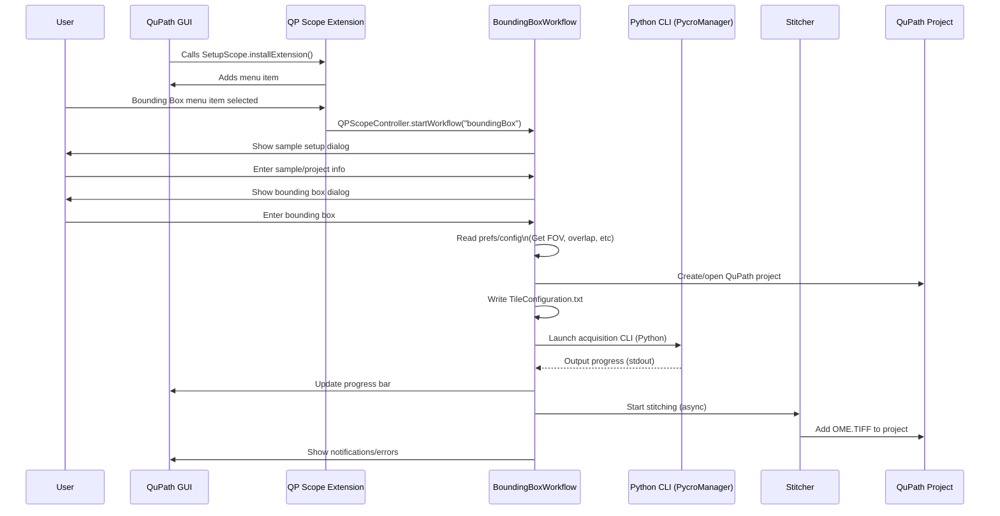

# QuPath extension template

[Documentation for old version of qp-scope](https://docs.google.com/document/d/1XBRZRJ0p-M71GUEMJQ4xSMDFfq8fcTMy6KwfbtxXz-Q/edit?tab=t.0)
[Documentation for setup of qpsc](https://docs.google.com/document/d/1XBRZRJ0p-M71GUEMJQ4xSMDFfq8fcTMy6KwfbtxXz-Q/edit?tab=t.0)

[PPM project](https://docs.google.com/document/u/3/d/1XefVDE7qYCOOUUUYZDh4zW0qORQXOUilt47npvDIW3M/mobilebasic#heading=h.ywwydiewamwm)
[Software design MVC]()


# QuPath Scope Control (QPSC) Extension

[](#)
[](#)
[](#)

## Overview

**QP Scope Control (QPSC)** is a modular extension for [QuPath](https://qupath.github.io/) that enables **automated stage control, microscope integration, and workflow-driven image acquisition** from within the QuPath GUI.  
The extension bridges QuPath, Python-based microscope controllers (e.g., Pycro-Manager), and custom acquisition workflows—enabling seamless, reproducible, and high-throughput imaging directly from your digital pathology projects.

---

## Features

- **Automated Stage Control**: Move XY, Z, and rotational (polarizer) stages with GUI bounds checking.
- **Flexible Acquisition Workflows**:
    - **Bounding Box Tiling**: Define a region in QuPath, auto-compute acquisition tiles, and trigger microscopy scans.
    - **Existing Image Registration**: Register new tile scans to previously acquired macro images with affine transformation support.
    - **Background Collection**: Automated flat-field correction image acquisition with adaptive exposure control for consistent background intensities.
    - **Polarizer Calibration (PPM)**: Automated rotation stage calibration to find crossed polarizer positions via angle sweep and sine curve fitting.
- **Modality Handlers**: Imaging modes are resolved through pluggable handlers (e.g., PPM). Modalities with no special requirements use a no-op handler.
- **Integration with Python Controllers**: Robust socket-based communication with real-time progress reporting and heartbeat monitoring between QuPath and your Python microscope backend.
- **Project & Data Management**: Automatic project creation, tile config, and stitched OME-TIFF integration.
- **Extensible GUI**: Easily add dialogs for new acquisition/analysis routines.
- **Error Handling**: User notifications for bounds violations, acquisition errors, and resource validation.

> **Note:** Polarized (PPM) acquisitions always use the PPM modality prefix (e.g., `ppm_20x`). Even at 90° rotation the run is still PPM rather than "brightfield". Modalities without the `ppm` prefix perform single-pass acquisitions with no polarization.

---

## Getting Started

### Prerequisites

- [QuPath 0.6.0+](https://qupath.github.io/)
- Java 21+
- Python 3.8+ (with your microscope control scripts, e.g., Pycro-Manager)
- Basic understanding of your microscope’s YAML configuration and available CLI interface

### Installation

1. **Clone this repository:**
    ```bash
    git clone https://github.com/your-lab/qupath-extension-qpsc.git
    cd qupath-extension-qpsc
    ```
2. **Build and copy the extension JAR** to your QuPath `extensions/` folder. Or, more easily, drag and drop the jar file into an open QuPath window.
3. **Configure** your microscope YAML (see `config_PPM.yml` sample) and shared hardware resource file (`resources/resources_LOCI.yml`).
4. **Edit your Python controller path** in the QuPath preferences as needed.

This extension requires qupath-extension-tiles-to-pyramid to create the pyramidal ome.tif files that will be added to your project.

### Usage

- **Launch QuPath** and open the "QP Scope" menu.
- **Acquisition Workflows**:
  - **"Start with Bounding Box"**: Acquire a defined region with automatic tiling.
  - **"Start with Existing Image"**: Register new high-res scans to a pre-existing macro image using affine transforms and annotation selection.
  - **"Microscope to Microscope Alignment"**: Semi-automated alignment workflow for coordinate transformation between QuPath and microscope coordinates.
- **Calibration & Utilities**:
  - **"Collect Background Images"**: Acquire flat-field correction backgrounds with adaptive exposure control. The system automatically adjusts exposure times to reach target intensities for consistent background quality.
  - **"Polarizer Calibration (PPM)"**: Calibrate PPM rotation stage to determine crossed polarizer positions. Sweeps rotation angles, fits data to sine curve, and generates a report with suggested `config_PPM.yml` angles. Run this only after optical component changes.
  - **"Basic Stage Control"**: Manual stage movement interface for testing.
  - **"Server Connection Settings"**: Configure socket communication with Python microscope server.

---
Multi-Sample Project Support
QPSC supports managing multiple samples within a single QuPath project through an automatic metadata tracking system. This enables complex multi-slide studies while maintaining proper data organization and acquisition validation.
How Metadata Works
Each image in a project is automatically tagged with metadata to track:

Image Collection: Groups related images (e.g., all acquisitions from the same physical slide)
XY Offsets: Physical position on the slide in micrometers for precise re-acquisition
Flip Status: Whether the image has been flipped (critical for microscope alignment)
Sample Name: Identifies which physical sample the image represents
Parent Relationships: Links sub-images to their source images

Key Behaviors

Automatic Collection Assignment

First image in a project gets image_collection=1
New unrelated images increment the collection number
Sub-images inherit their parent's collection number


Flip Validation

When X/Y flips are enabled in preferences, only flipped images can be used for acquisition
Prevents acquisition errors due to coordinate system mismatches
Original (unflipped) images are preserved with all annotations


Position Tracking

Each image stores its offset from the slide corner
Sub-images calculate their position relative to the parent
Enables accurate stage positioning for multi-region acquisition


Multi-Sample Workflow Example

Import multiple slides into one project

Each gets a unique image_collection number
Metadata tracks which images belong together


Create flipped versions if needed

Use the "Create Flipped Duplicate" function
Annotations and hierarchy are automatically transformed
Both versions exist in the project with proper metadata


Acquire sub-regions from any image

Extension validates flip status before acquisition
Sub-images inherit the parent's collection
All related images stay grouped by metadata


Best Practices

Let the system manage metadata automatically - manual editing may break workflows
When working with flipped images, always use the flipped version for acquisition
Use descriptive sample names when setting up projects for easier identification
Sub-images from the same parent will share the same collection number for easy filtering

This metadata system operates transparently in the background, ensuring data integrity while supporting complex multi-sample workflows.

---

## Calibration Workflows

### Background Collection

**Purpose**: Acquire flat-field correction images for improved image quality and quantitative analysis.

**Key Features**:
- **Adaptive Exposure Control**: Automatically adjusts exposure times to reach target grayscale intensities (e.g., 245 for PPM 90°, 125 for PPM 0°)
- **Fast Convergence**: Typically achieves target intensity in 2-5 iterations using proportional control algorithm
- **Accurate Metadata**: Records actual exposure times used (not requested values) for reproducibility
- **Modality Support**: Works with all imaging modes (PPM, brightfield, etc.)

**When to Use**:
- Initial microscope setup
- After light source changes or bulb replacement
- When image quality degrades
- For quantitative imaging requiring flat-field correction

**Workflow**:
1. Position microscope at clean, blank area (uniform background)
2. Select **"Collect Background Images"** from menu
3. Choose modality, objective, and output folder
4. Review/adjust angles and initial exposure estimates
5. System acquires backgrounds, adjusting exposure automatically
6. Metadata files saved with actual exposure values for each angle

### Polarizer Calibration (PPM)

**Purpose**: Determine optimal crossed polarizer angles for PPM (Polarized Light Microscopy) imaging.

**Key Features**:
- **Automated Angle Sweep**: Rotates polarizer through configurable range (default 0-360°)
- **Sine Curve Fitting**: Uses `scipy` to fit intensity vs. angle data
- **Minima Detection**: Automatically identifies crossed polarizer positions (local intensity minima)
- **Comprehensive Report**: Generates text file with calibration results and config suggestions

**When to Use**:
- After installing or repositioning polarization optics
- After reseating or replacing rotation stage
- To validate or update `rotation_angles` in `config_PPM.yml`
- NOT needed for routine imaging sessions

**Workflow**:
1. Position microscope at uniform, bright background
2. Select **"Polarizer Calibration (PPM)..."** from menu
3. Configure sweep parameters:
   - Start/End angles (default: 0° to 360°)
   - Step size (default: 5°; smaller = more accurate but slower)
   - Exposure time (default: 10ms; keep short to avoid saturation)
4. Start calibration (~90 seconds for full 360° sweep at 5° steps)
5. Review generated report containing:
   - Crossed polarizer angles (for `config_PPM.yml`)
   - Intensity statistics and dynamic range
   - Sine fit parameters
   - Raw data for verification
6. Update `config_PPM.yml` with suggested crossed angles

**Output Report Includes**:
```
CROSSED POLARIZER POSITIONS (MINIMA)
================================================================================
Found 4 crossed polarizer positions:
  Position 1: Angle: -5.20 deg, Intensity: 125.3
  Position 2: Angle: 0.10 deg, Intensity: 118.7
  Position 3: Angle: 5.30 deg, Intensity: 126.1
  Position 4: Angle: 175.00 deg, Intensity: 122.5

CONFIG_PPM.YML UPDATE SUGGESTIONS
================================================================================
rotation_angles:
  - name: 'crossed'
    angles: [-5.2, 0.1, 5.3, 175.0]
  - name: 'uncrossed'
    angles: [90.0]
```

---

📁 File Structure

```text

qupath-extension-qpsc/
├── .github/
├── .gradle/
├── .idea/
├── build/
├── gradle/
├── src/
│   ├── main/
│   │   ├── java/
│   │   │   └── qupath/
│   │   │       └── ext/
│   │   │           └── qpsc/
│   │   │               ├── controller/
│   │   │               ├── modality/
│   │   │               ├── preferences/
│   │   │               ├── service/
│   │   │               ├── ui/
│   │   │               ├── utilities/
│   │   │               ├── QPScopeChecks.java
│   │   │               └── SetupScope.java
│   │   └── resources/
│   │       └── qupath/
│   │           └── ext/
│   │               └── qpsc/
│   │                   └── ui/
│   │                       ├── interface.fxml
│   │                       └── strings.properties
│   └── test/
│       └── java/
│           └── qupath/
│               └── ext/
│                   └── qpsc/
│                       ├── CoordinateTransformationTest.java
│                       ├── QPProjectFunctionsTest.java
│                       └── WorkflowTests.java
├── resources/
│   ├── config_PPM.yml
│   ├── resources_LOCI.yml
│   └── ...
├── heartbeat_client.py
├── build.gradle.kts
├── settings.gradle.kts
├── .gitignore
├── README.md
└── project-structure.txt

```

Legend
controller/ – Main workflow logic for acquisition, bounding box, existing image, etc.

modality/ – Pluggable modality handlers (e.g., PPM) and rotation utilities.

preferences/ – User settings and persistent configuration.

service/ – Abstractions for CLI/Python process integration.

ui/ – User dialogs (JavaFX), UI controllers for user input and feedback.

utilities/ – Helpers for file IO, YAML/JSON, tiling, stitching, etc.

resources/ – Configuration files (YAML), FXML, localizable strings.

test/ – Unit and integration tests.

heartbeat_client.py – Python script for test/integration workflows.


Workflow Overview:
The diagram below illustrates the sequence of operations when a user performs an “Acquire by Bounding Box” workflow in the QP Scope extension. User input and configuration guide the Java workflow, which orchestrates microscope control via Python scripts, handles asynchronous stitching, and integrates the final OME-TIFF into the QuPath project.
### Bounding Box Acquisition Workflow


## YAML Configuration
Microscope config: Describes imaging modes, detectors, objectives, stage limits, etc. (config_PPM.yml)

Shared resources: Centralized lookup for hardware IDs (cameras, objectives, stages), e.g., for multi-microscope setups (resources/resources_LOCI.yml).

## Development & Testing
Workflows are in controller/. GUI dialogs are in ui/.

Unit tests use JUnit and Mockito. See src/test/ for examples.

Extending: Add new dialogs, Python commands, or custom modalities by implementing a `ModalityHandler` and registering it via `ModalityRegistry.registerHandler`.

## Troubleshooting
No hardware connection? Check CLI path and microscope YAML.

Timeouts during acquisition? Adjust inactivity timeouts and check the Python script’s heartbeat.

Resource warnings? Verify the path to resources_LOCI.yml is correct and matches your microscope folder layout.

## License
MIT License (see LICENSE)

## Citation
If you use this extension in published work, please cite the QuPath platform and this repository.

Acknowledgments
Developed by LOCI, UW-Madison
With thanks to the QuPath community and everyone contributing to open-source microscopy.

For support, issues, and feature requests, please use GitHub Issues.