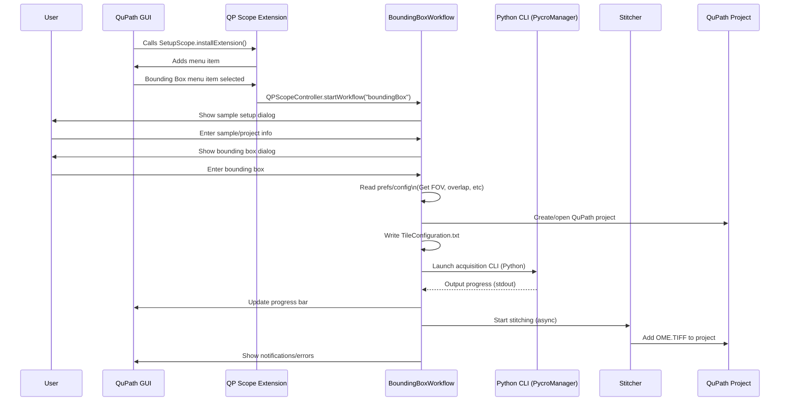

# QuPath extension template

[Documentation for old version of qp-scope](https://docs.google.com/document/d/1XBRZRJ0p-M71GUEMJQ4xSMDFfq8fcTMy6KwfbtxXz-Q/edit?tab=t.0)
[Documentation for setup of qpsc](https://docs.google.com/document/d/1XBRZRJ0p-M71GUEMJQ4xSMDFfq8fcTMy6KwfbtxXz-Q/edit?tab=t.0)

[PPM project](https://docs.google.com/document/u/3/d/1XefVDE7qYCOOUUUYZDh4zW0qORQXOUilt47npvDIW3M/mobilebasic#heading=h.ywwydiewamwm)
[Software design MVC]()


# QuPath Scope Control (QPSC) Extension

[](#)
[](#)
[](#)

## Overview

**QP Scope Control (QPSC)** is a modular extension for [QuPath](https://qupath.github.io/) that enables **automated stage control, microscope integration, and workflow-driven image acquisition** from within the QuPath GUI.  
The extension bridges QuPath, Python-based microscope controllers (e.g., Pycro-Manager), and custom acquisition workflows—enabling seamless, reproducible, and high-throughput imaging directly from your digital pathology projects.

---

## Features

- **Automated Stage Control**: Move XY, Z, and rotational (polarizer) stages with GUI bounds checking.
- **Flexible Acquisition Workflows**:
    - **Bounding Box Tiling**: Define a region in QuPath, auto-compute acquisition tiles, and trigger microscopy scans.
    - **Existing Image Registration**: Register new tile scans to previously acquired macro images with affine transformation support.
- **Integration with Python Controllers**: Robust CLI command execution, heartbeat monitoring, and real-time progress reporting between QuPath and your Python microscope backend.
- **Project & Data Management**: Automatic project creation, tile config, and stitched OME-TIFF integration.
- **Extensible GUI**: Easily add dialogs for new acquisition/analysis routines.
- **Error Handling**: User notifications for bounds violations, acquisition errors, and resource validation.

---

## Getting Started

### Prerequisites

- [QuPath 0.6.0+](https://qupath.github.io/)
- Java 21+
- Python 3.8+ (with your microscope control scripts, e.g., Pycro-Manager)
- Basic understanding of your microscope’s YAML configuration and available CLI interface

### Installation

1. **Clone this repository:**
    ```bash
    git clone https://github.com/your-lab/qupath-extension-qpsc.git
    cd qupath-extension-qpsc
    ```
2. **Build and copy the extension JAR** to your QuPath `extensions/` folder. Or, more easily, drag and drop the jar file into an open QuPath window.
3. **Configure** your microscope YAML (see `config_PPM.yml` sample) and shared hardware resource file (`resources/resources_LOCI.yml`).
4. **Edit your Python controller path** in the QuPath preferences as needed.

This extension requires qupath-extension-tiles-to-pyramid to create the pyramidal ome.tif files that will be added to your project.

### Usage

- **Launch QuPath** and open the “QP Scope” menu.
- Use “Test Workflow” for stage movement and heartbeat demo.
- Use “Bounding Box Workflow” to acquire a defined region with automatic tiling.
- Use “Existing Image Workflow” to register new high-res scans to a pre-existing macro image, using affine transforms and annotation selection.

---

## File Structure - incomplete
qupath-extension-qpsc/
│
├── src/
│ ├── qupath/ext/qpsc/controller/ # Workflow orchestration logic
│ ├── qupath/ext/qpsc/ui/ # GUI dialogs & controllers
│ ├── qupath/ext/qpsc/preferences/ # Preferences management
│ ├── qupath/ext/qpsc/utilities/ # YAML/JSON, tile config, stitching, etc.
│ └── ...
├── resources/
│ ├── config_PPM.yml # Example microscope config
│ ├── resources_LOCI.yml # Shared hardware resource data
│ └── ...
├── build.gradle.kts # Gradle build script
└── README.md

Workflow Overview:
The diagram below illustrates the sequence of operations when a user performs an “Acquire by Bounding Box” workflow in the QP Scope extension. User input and configuration guide the Java workflow, which orchestrates microscope control via Python scripts, handles asynchronous stitching, and integrates the final OME-TIFF into the QuPath project.
### Bounding Box Acquisition Workflow


## YAML Configuration
Microscope config: Describes imaging modes, detectors, objectives, stage limits, etc. (config_PPM.yml)

Shared resources: Centralized lookup for hardware IDs (cameras, objectives, stages), e.g., for multi-microscope setups (resources/resources_LOCI.yml).

## Development & Testing
Workflows are in controller/. GUI dialogs are in ui/.

Unit tests use JUnit and Mockito. See src/test/ for examples.

Extending: Add new dialogs or Python commands by following the MVC structure.

## Troubleshooting
No hardware connection? Check CLI path and microscope YAML.

Timeouts during acquisition? Adjust inactivity timeouts and check the Python script’s heartbeat.

Resource warnings? Verify the path to resources_LOCI.yml is correct and matches your microscope folder layout.

## License
MIT License (see LICENSE)

## Citation
If you use this extension in published work, please cite the QuPath platform and this repository.

Acknowledgments
Developed by LOCI, UW-Madison
With thanks to the QuPath community and everyone contributing to open-source microscopy.

For support, issues, and feature requests, please use GitHub Issues.